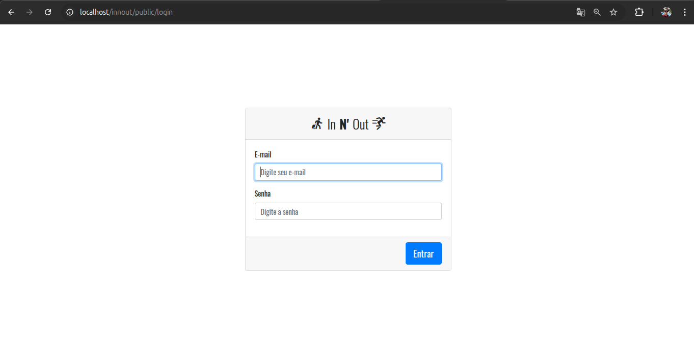
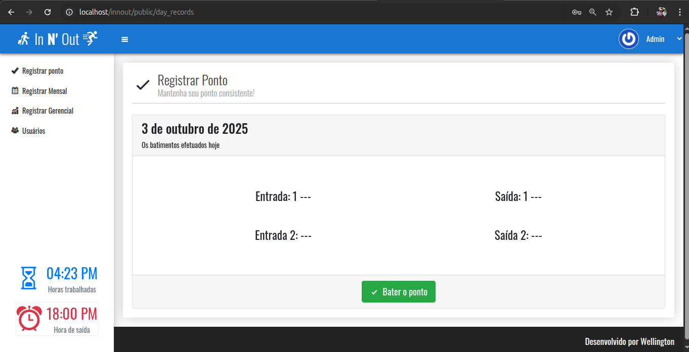

# 🚪 IN N' OUT - Sistema de Ponto Eletrônico

Um sistema simples e eficiente para controle de jornada de trabalho (bater ponto) via interface web, desenvolvido em PHP.

## 🎯 Visão Geral do Projeto

O **IN N' OUT** é uma aplicação web focada em registrar digitalmente as **Entradas** e **Saídas** de funcionários. Ele adota uma abordagem de Modelagem de Dados e foca em uma interface limpa e segura para a gestão da jornada de trabalho diária.

## ✨ Recursos Principais

* **Autenticação Segura:** Login baseado em e-mail e senha com uso de *hashing* seguro (`password_verify`).
* **Controle de Ponto Rápido:** Interface amigável para registrar o ponto com um único clique (Tela Home).
* **Registro da Jornada:** Exibição em tempo real das batidas do dia e cálculo da duração do trabalho (saldo de horas).
* **Modelo Extensível:** Uso de uma classe `Model` base para abstração da camada de banco de dados.

---

## ⚙️ Configuração e Instalação

Para rodar este projeto localmente, siga os passos abaixo.

### Pré-requisitos

Certifique-se de ter instalado em seu ambiente:

* **PHP** (versão 7.4 ou superior recomendada)
* **MySQL** (ou MariaDB)
* **Servidor Web** (Apache ou Nginx)

### 1. Clonar o Repositório

```bash
git clone https://github.com/Wellington-Silva/Innout.git
cd innout
```

### 2. Configurar o Banco de Dados
Crie um novo banco de dados (ex: innout) e execute os comandos SQL abaixo para criar as tabelas users e records.

-- Estrutura da Tabela: users
```bash
CREATE TABLE users (
    id INT AUTO_INCREMENT PRIMARY KEY,
    name VARCHAR(100) NOT NULL,
    email VARCHAR(100) UNIQUE NOT NULL,
    password VARCHAR(255) NOT NULL,
    start_date DATE NOT NULL,
    end_date DATE,
    is_admin BOOLEAN DEFAULT FALSE
);
```

-- Estrutura da Tabela: records (Registros de Ponto)
```bash
CREATE TABLE records (
    id INT AUTO_INCREMENT PRIMARY KEY,
    user_id INT NOT NULL,
    work_date DATE NOT NULL,
    time TIME NOT NULL,
    created_at DATETIME DEFAULT CURRENT_TIMESTAMP,
    FOREIGN KEY (user_id) REFERENCES users(id)
);
```

### 3. Configurar o PHP
Edite o arquivo de configuração da aplicação (geralmente em src/config/config.php) e substitua os valores conforme seu ambiente.

```bash
// Configurações do Banco de Dados (Substitua pelos seus dados)
define('DB_HOST', 'localhost');
define('DB_USER', 'root');
define('DB_PASS', 'sua_senha_mysql');
define('DB_NAME', 'innout');

// Configuração de Fuso Horário
date_default_timezone_set('America/Sao_Paulo'); 
```

### 4. Acesso
Inicie o seu servidor web e acesse o sistema pelo seu navegador.

- Login: http://localhost/innout/login.php

- Home: http://localhost/innout/index.php

# 💻 Telas da Aplicação
- Tela inicial para autenticação de usuários.


- Tela principal para o registro do ponto e visualização da jornada diária.


# 🛠️ Tecnologias Utilizadas
- **Back-end**: PHP
- **Banco de Dados:** MySQL
- **Front-end**: HTML e CSS

# 🤝 Contribuições
Contribuições são bem-vindas! Se você encontrou um bug ou tem sugestões de melhoria, sinta-se à vontade para abrir uma issue ou enviar um Pull Request.

1. Faça um Fork do projeto.

2. Crie uma branch para sua funcionalidade (git checkout -b feature/nome-da-feature).

3. Faça o commit das suas alterações (git commit -m 'feat: Adiciona melhoria de segurança X').

4. Abra um Pull Request.
